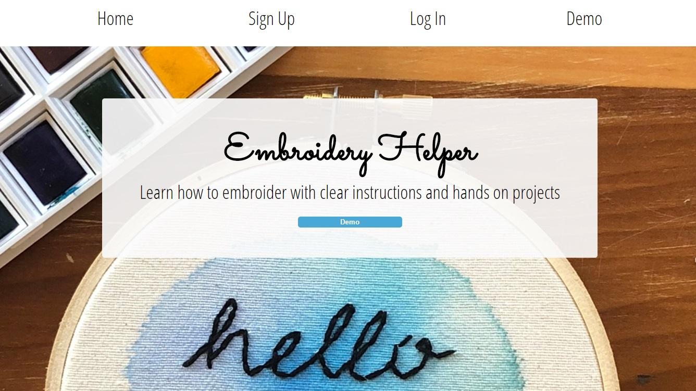
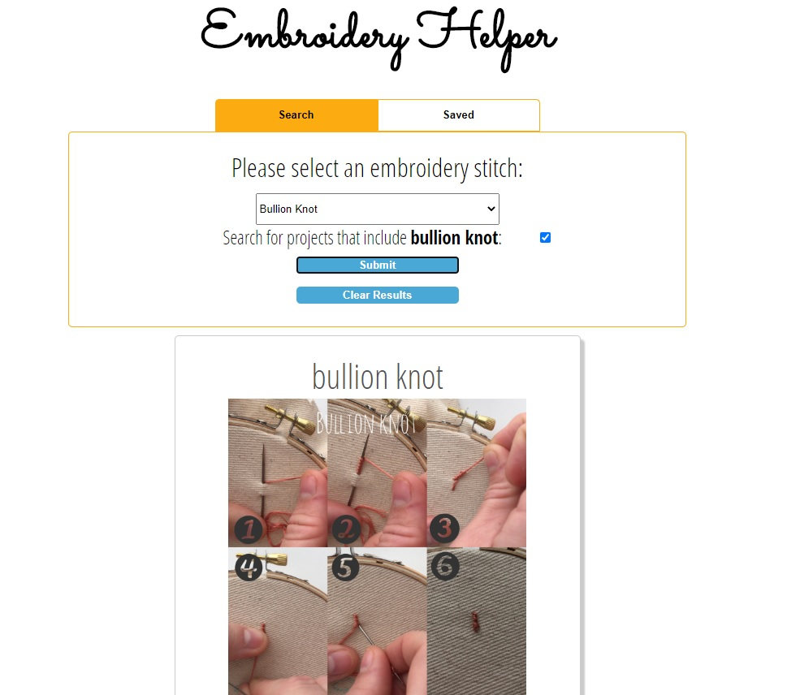

## About
The hand embroidery app is a full stack application that helps the user learn how to embroider. Upon creating an account, the user is able to search for embroidery stitches and projects to learn, as well as save and delete embroidery stitches and projects to their account. 

## Technologies Used
* HTML
* CSS
* Javascript
* React 
* Node.js
* Express
* PostgreSQL
* RESTful API

## Screenshots

